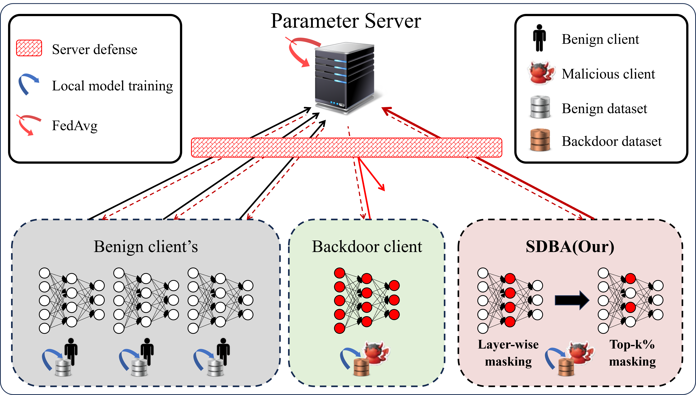

# SDBA: A Stealthy and Long-Lasting Durable Backdoor Attack in Federated Learning


The code for the SDBA paper([arXiv link](https://arxiv.org/abs/2409.14805)) was implemented using Python 3.12.1, PyTorch 2.4.0, and Torchvision 0.19.0.

This repository is primarily based on the foundational code structure from\
"How to Backdoor Federated Learning" (https://github.com/ebagdasa/backdoor_federated_learning) and\
"Neurotoxin: Durable Backdoors in Federated Learning" (https://github.com/jhcknzzm/Federated-Learning-Backdoor) for code development.

---
## T5 experiments
For details on the T5 experiments, please check the [T5 folder](./T5).

## Preparation
First, download the Reddit dataset from https://github.com/ebagdasa/backdoor_federated_learning and save it in the `/data` directory.

Second, Set up the model saving checkpoint.

In `utils/words_reddit_lstm.yaml`, input `save_on_epochs: [2000]` and save the file.

`python main_training.py --params utils/words_reddit_lstm.yaml --run_name benign_2000  --GPU_id 0 --start_epoch 1 --semantic_target True --same_structure True --aggregate_all_layer 1 --s_norm 3.0 --sentence_id_list 0`

Enter the above command, train the model for 2000 rounds, and save the trained model.

Then, perform the SDBA backdoor attack using the trained model.


## Performing the Attack

### SDBA
`python main_training.py --params utils/words_reddit_lstm.yaml --run_name SDBA  --GPU_id 0  --masking True --ih 0.2 --hh 1.0 --is_poison True --poison_lr 0.06 --start_epoch 2001 --semantic_target True --attack_num 100 --same_structure True --aggregate_all_layer 1 --s_norm 3.0 --sentence_id_list 0`

For various attack examples, please refer to the `example.sh` file.

### Other Attacks for Comparison

**Baseline**\
`python main_training.py --params utils/words_reddit_lstm.yaml --run_name baseline_attack  --GPU_id 0  --gradmask_ratio 1.0 --is_poison True --poison_lr 0.06 --start_epoch 2001 --semantic_target True --attack_num 100 --same_structure True --aggregate_all_layer 1 --s_norm 3.0 --sentence_id_list 0`

**Neurotoxin**\
To perform the Neurotoxin attack, rename `helper_neurotoxin.py` to `helper.py` and execute the following command\
`python main_training.py --params utils/words_reddit_lstm.yaml --run_name neurotoxin_attack  --GPU_id 0  --gradmask_ratio 0.98 --is_poison True --poison_lr 0.06 --start_epoch 2001 --semantic_target True --attack_num 100 --same_structure True --aggregate_all_layer 1 --s_norm 3.0 --sentence_id_list 0`


## Parameter list
### General Parameters
`--is_poison True` : Enable poisoning task\
`--poison_lr 0.6` : Learning rate for malicious clients\
`--attack_num 100` : Number of attacks to perform\
`--start_epoch 2001` : Starting epoch for the training\
`--run_name filename` : Name for saved backdoor_acc or benign_acc file\
`--PGD 1` : Activate Projected Gradient Descent\
`--GPU_id 0` : Specify the GPU ID to use\
`--masking True` : Enable SDBA masking technique

### Defense Parameters
`--norm_clip True` : Enable Norm Clipping defense\
`--multi_krum True` : Enable Multi-Krum defense\
`--diff_privacy True` : Enable Weak Differential Privacy defense\
`--flame True` : Enable Flame defense

### LSTM Model Parameters
`--ih 0.2` : Input-hidden layer masking ratio\
`--hh 1.0` : Hidden-hidden layer masking ratio

### GPT-2 Model Parameters
`--mlp_fc 1.0` : MLP fully connected layer masking ratio

---

## Citation

If you find this repository helpful for your work, we would appreciate it if you could cite our paper.

```
@ARTICLE{11098907,
  author={Choe, Minyeong and Park, Cheolhee and Seo, Changho and Kim, Hyunil},
  journal={IEEE Transactions on Dependable and Secure Computing}, 
  title={SDBA: A Stealthy and Long-Lasting Durable Backdoor Attack in Federated Learning}, 
  year={2025},
  volume={},
  number={},
  pages={1-14},
  keywords={Natural language processing;Federated learning;Training;Servers;Computational modeling;Security;Data models;Analytical models;Transformers;Long short term memory;Backdoor Attack;Backdoor Durability;Backdoor Stealthiness;Federated Learning (FL);Natural Language Processing (NLP)},
  doi={10.1109/TDSC.2025.3593640}}
```

